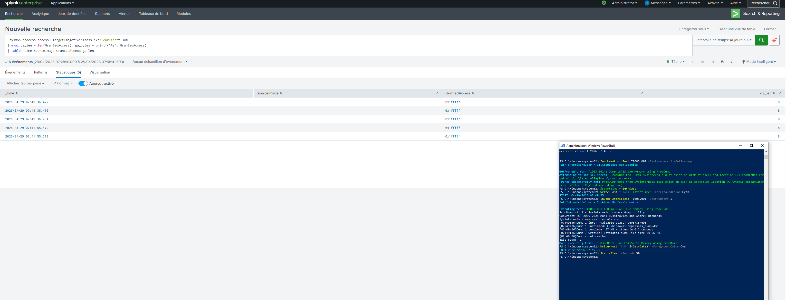
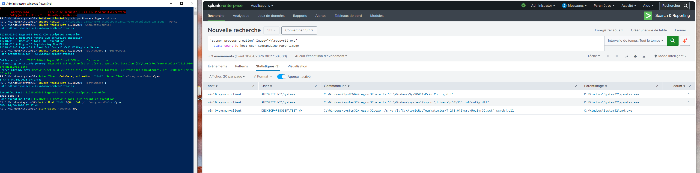

## Validated detections

Eight detections validated end-to-end via Atomic Red Team or manual reproduction. Each row links to the detection rule and a Splunk screenshot showing the rule firing on real telemetry.

| ATT&CK | Detection | Test method | Evidence |
|---|---|---|---|
| T1003.001 | [LSASS access via ProcDump](detections/win_sysmon_t1003.001_lsass_access_suspicious.md) | `Invoke-AtomicTest T1003.001 -TestNumbers 1` | [screenshot](tests/atomic/evidence/T1003.001-detection-fired.png) |
| T1059.001 | [PowerShell encoded command](detections/win_sysmon_t1059.001_powershell_encoded.md) | manual | [screenshot](tests/atomic/evidence/T1059.001-encoded-powershell.png) |
| T1136.001 | [Local account creation](detections/win_secevt_t1136.001_local_account_creation.md) | `Invoke-AtomicTest T1136.001 -TestNumbers 4` | [screenshot](tests/atomic/evidence/T1136.001-local-account.png) |
| T1140 | [Certutil decode](detections/win_sysmon_t1140_certutil_decode.md) | `Invoke-AtomicTest T1140 -TestNumbers 2` | [screenshot](tests/atomic/evidence/T1140-certutil-decode.png) |
| T1218.005 | [Mshta execution](detections/win_sysmon_t1218.005_mshta_execution.md) | `Invoke-AtomicTest T1218.005 -TestNumbers 2` | [screenshot](tests/atomic/evidence/T1218.005-mshta-vbscript.png) |
| T1218.010 | [Regsvr32 (Squiblydoo)](detections/win_sysmon_t1218.010_regsvr32_remote.md) | `Invoke-AtomicTest T1218.010 -TestNumbers 1` | [screenshot](tests/atomic/evidence/T1218.010-regsvr32-squiblydoo.png) |
| T1218.011 | [Rundll32 LOLBin](detections/win_sysmon_t1218.011_rundll32_unusual_parent.md) | manual | [screenshot](tests/atomic/evidence/T1218.011-rundll32.png) |
| T1547.001 | [Run key persistence](detections/win_sysmon_t1547.001_run_key_modification.md) | manual | [screenshot](tests/atomic/evidence/T1547.001-run-key.png) |

Featured screenshots:


*T1003.001 - LSASS dump via ProcDump caught by access mask filtering. Sysmon-modular even tags the technique natively in `RuleName`.*


*T1218.010 - regsvr32 Squiblydoo bypass via local .sct scriptlet.*

The OneDrive entries visible in the run-key screenshot are real false positives observed in the lab, documented and tuned in [`lookups/allowlist_run_keys.csv`](lookups/allowlist_run_keys.csv). Detection engineering doesn't end at "the rule fires"; it ends at "the rule fires only when it should."

---
# Splunk Detection Lab

A single-host Splunk Enterprise lab focused on **detection engineering** and **SOC L2/L3 investigation workflows** for Windows endpoints. Telemetry is collected via Sysmon-modular and the Splunk Universal Forwarder, normalized to CIM, and used to develop, test, and tune behavioral detections mapped to MITRE ATT&CK.

This repository is structured as a *detection-as-code* project: every rule has a written hypothesis, an SPL implementation, a tuning strategy, known false positives, an Atomic Red Team validation test, and a runbook for the analyst on call.

---

## Architecture

```
+---------------------+        TCP/9997        +-----------------------+
|  Windows 10/11 VM   |  ───────────────────▶  |  Debian 12 (Splunk)   |
|  Sysmon-modular     |                        |  Splunk Enterprise    |
|  Splunk UF 9.x      |                        |  Indexes: win, sysmon |
+---------------------+                        |  CIM, macros, lookups |
                                               +-----------------------+
```

Diagram (mermaid) and detailed component breakdown: [`docs/architecture.md`](docs/architecture.md).

---

## What this lab demonstrates

| Capability | Where to look |
|---|---|
| Detection-as-code workflow | [`detections/`](detections/) |
| ATT&CK coverage tracking | [`coverage/`](coverage/) |
| CIM-normalized data with macros | [`macros/macros.conf`](macros/macros.conf) |
| Purple-team validation (Atomic Red Team) | [`tests/atomic/`](tests/atomic/) |
| Analyst runbooks for L2/L3 triage | [`docs/runbooks/`](docs/runbooks/) |
| Sysmon-modular deployment & rationale | [`docs/adr/0001-sysmon-modular.md`](docs/adr/0001-sysmon-modular.md) |
| Threat hunting hypotheses (non-alerting) | [`hunting/`](hunting/) |

---

## Repository layout

```
splunk-detection-lab/
├── README.md
├── CONVENTIONS.md              # naming, rule format, ATT&CK mapping rules
├── CHANGELOG.md
├── detections/                 # one file per detection (YAML front-matter + SPL)
│   ├── _template.md
│   └── win_proc_<id>_<name>.md
├── hunting/                    # hypothesis-driven SPL queries (not alerts)
├── tests/
│   └── atomic/                 # Atomic Red Team test mappings + evidence
├── macros/                     # macros.conf – CIM-friendly building blocks
├── lookups/                    # asset.csv, identity.csv, suspicious_*.csv
├── conf/
│   ├── splunk/local/           # indexes.conf, props.conf, transforms.conf
│   ├── sysmon/                 # sysmon-modular merged config + version pin
│   └── uf/                     # inputs.conf, outputs.conf for the forwarder
├── dashboards/                 # SimpleXML dashboards (SOC overview, MITRE)
├── coverage/                   # ATT&CK Navigator JSON layer + coverage.md
├── docs/
│   ├── architecture.md
│   ├── adr/                    # Architecture Decision Records
│   ├── runbooks/               # one per detection family
│   └── screenshots/
├── scripts/                    # helper scripts (validation, Atomic launcher)
└── .github/workflows/          # SPL/YAML lint on every push
```

---

## Detection lifecycle

Every rule in [`detections/`](detections/) follows the same lifecycle, documented per file:

1. **Hypothesis** – what adversary behavior we are trying to surface
2. **Data source** – Sysmon EID / Windows EID / CIM data model
3. **Logic (SPL)** – the search itself, written against macros, not raw indexes
4. **Known false positives** – enumerated, not hand-waved
5. **Tuning** – allowlists, thresholds, references to lookups
6. **Validation** – exact Atomic Red Team test that triggers the rule, with evidence
7. **Response** – pointer to the runbook in [`docs/runbooks/`](docs/runbooks/)

The full template lives at [`detections/_template.md`](detections/_template.md).

---

## ATT&CK coverage (target)

Initial scope is the techniques most relevant to a Windows SOC L2/L3 analyst. Live coverage is rendered in `coverage/coverage.md` and the matching ATT&CK Navigator layer in `coverage/navigator-layer.json`.

| Tactic | Techniques in scope |
|---|---|
| Initial Access | T1566.001 |
| Execution | T1059.001, T1059.003, T1204.002 |
| Persistence | T1547.001, T1053.005, T1136.001 |
| Privilege Escalation | T1055, T1134 |
| Defense Evasion | T1218 (rundll32, regsvr32, mshta), T1027, T1140, T1562.001, T1112 |
| Credential Access | T1003.001, T1110, T1558 |
| Discovery | T1087, T1018, T1057 |
| Lateral Movement | T1021.001, T1021.002 |
| Collection / Impact | T1486, T1490 |
| Command & Control | T1071.001, T1090 |

---

## Quickstart

The lab is reproducible from scratch:

1. Stand up the Splunk server – [`docs/install-splunk-debian.md`](docs/install-splunk-debian.md)
2. Onboard the Windows endpoint – [`docs/install-windows-endpoint.md`](docs/install-windows-endpoint.md)
3. Apply Splunk configs from [`conf/splunk/local/`](conf/splunk/local/) and restart
4. Apply UF configs from [`conf/uf/`](conf/uf/)
5. Deploy the Sysmon-modular merged config from [`conf/sysmon/`](conf/sysmon/)
6. Validate ingestion – [`docs/validation.md`](docs/validation.md)
7. Run the purple-team test suite – `scripts/run-atomic-suite.ps1`

---

## Limitations & honest caveats

This is a single-host lab. In a production SOC the following would be different and are deliberately **out of scope** here:

- No domain controller — AD-related techniques (Kerberoasting, DCSync) are not validated end-to-end
- No EDR — detections rely solely on Sysmon + Windows event channels
- No SOAR — runbooks are markdown, not Phantom/XSOAR playbooks
- No deployment server — UF configs are pushed manually
- Risk-Based Alerting is implemented in raw SPL into a `risk` index, not via Enterprise Security

A production-grade follow-up plan is documented in [`docs/production-gap.md`](docs/production-gap.md).

---

## License

MIT. Use, fork, criticize.
