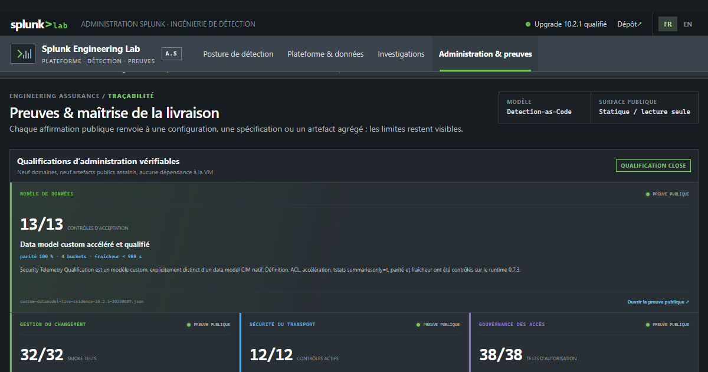
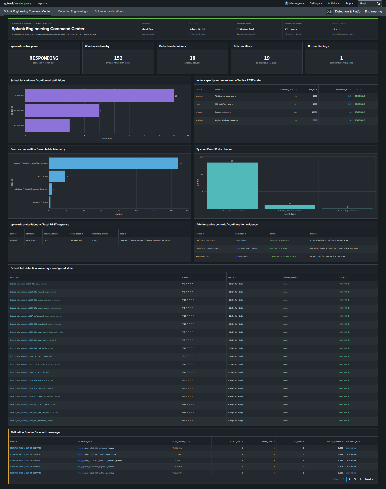
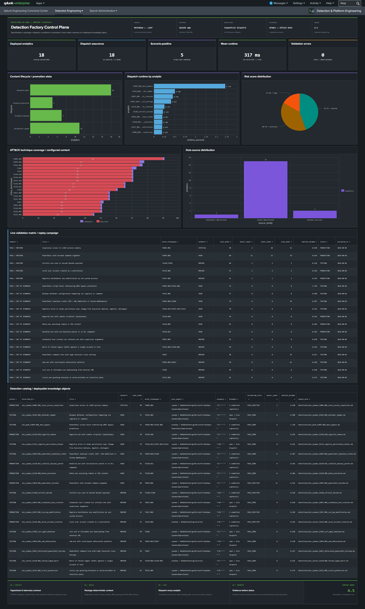
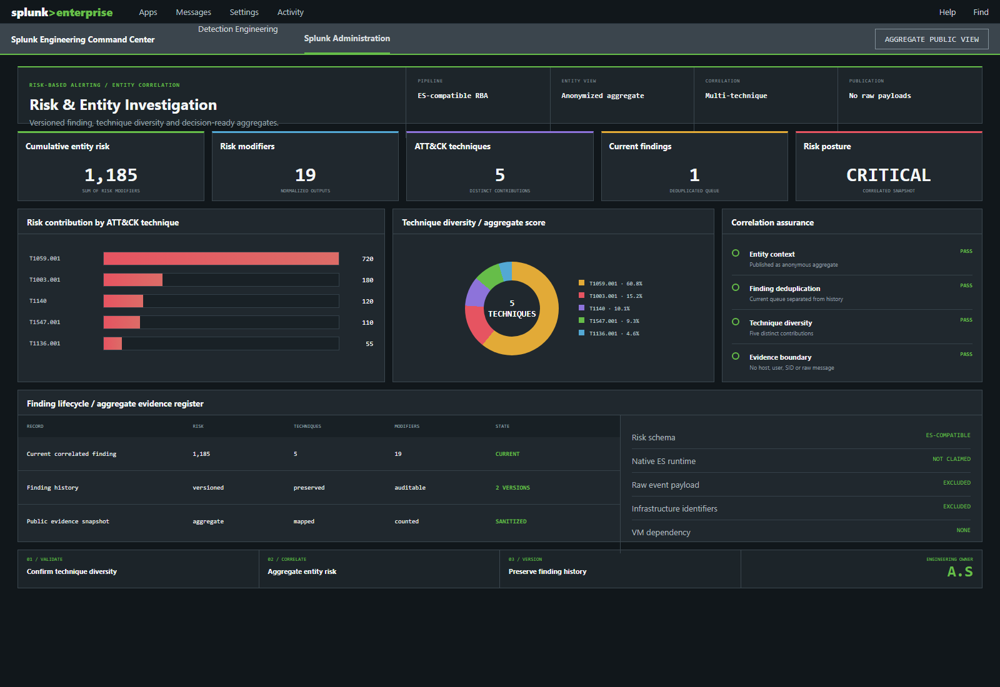

# Splunk Detection & Platform Engineering

[](https://lordmonstey.github.io/splunk-detection-lab/)
[](detections/)
[](docs/rba-investigation.md)
[](docs/platform-assurance.md)
[](docs/projects/splunk-upgrade-9.4-to-10.2.md)
[](artifacts/public/custom-datamodel-live-evidence-10.2.1-20260807.json)
[](artifacts/public/periodic-reporting-live-evidence-10.2.1-20260807.json)
[](artifacts/public/parsing-canary-rollback-evidence-20260807.json)
[](conf/splunk/)

Un projet de **Detection Engineering** et d’**administration Splunk** qui ne
s’arrête pas à une collection de recherches SPL. Le dépôt livre une application
Splunk installable, un catalogue de 18 détections, une campagne de validation,
un pipeline RBA compatible Splunk ES, six dashboards natifs et un portfolio
statique consultable même lorsque l’infrastructure est éteinte. Trois captures
agrégées, revues avant publication, documentent les principales surfaces.

Le site public est en français par défaut, possède un switch anglais, ne fait
aucun appel réseau à une VM et ne publie ni secret, ni adresse privée, ni
événement brut.

[**Ouvrir la surface opérateur interactive →**](https://lordmonstey.github.io/splunk-detection-lab/)



## Snapshot d’ingénierie vérifié

| Contrôle | Résultat observé |
|---|---:|
| Application Splunk du snapshot historique | `Detection & Platform Engineering` 0.6.4 |
| Détections déployées et exécutées | **18 / 18** |
| Scénarios positifs dans la campagne | **5** |
| Erreurs de dispatch | **0** |
| Recherches des dashboards validées | **49 / 49** |
| Télémétrie Windows contrôlée | **152 événements** |
| Complétude des champs CIM processus | **100 %** |
| Risk modifiers matérialisés | **19** |
| Risque cumulé de l’entité | **1 185** |
| Techniques ATT&CK corrélées | **5** |
| Findings courants / versions | **1 / 2** |

Ce tableau décrit le snapshot historique du 6 août 2026. Le runtime courant
utilise l’application `0.7.3`. La source publique assainie est
[`artifacts/public/splunk-engineering-snapshot-20260806.json`](artifacts/public/splunk-engineering-snapshot-20260806.json).
Elle relie les métriques historiques aux artefacts publics agrégés ; les
captures retirées sont consignées dans le
[registre public de retrait](artifacts/public/evidence-redaction-register-20260807.json).

## Montée de version et rollback qualifiés

La séquence live `9.4.13 -> 10.2.1 -> rollback snapshot 9.4.13 -> 10.2.1`
a validé **32 smoke tests sur 32**, l'équivalence des inventaires et manifestes,
la santé de splunkd, le KV Store, la licence et la restauration de la baseline.

[Lire le dossier de changement](docs/projects/splunk-upgrade-9.4-to-10.2.md) ·
[ouvrir la preuve assainie](artifacts/public/upgrade-evidence-9-4-13-to-10-2-1-live.json) ·
[ouvrir le rapport de validation](artifacts/public/upgrade-evidence-validation-9-4-13-to-10-2-1-live.json)

La qualification concerne Splunk Enterprise standalone. Splunk Enterprise
Security n'était pas installé, et Debian 13 reste une plateforme de laboratoire,
pas une certification de support éditeur.

## Data model custom accéléré

Le runtime courant, Splunk Enterprise `10.2.1` avec l'application `0.7.3`,
embarque `Security Telemetry Qualification`. Il s'agit explicitement d'un data
model custom, et non d'un data model CIM natif. La qualification live ferme
**13 contrôles sur 13** : définition, ACL, accélération, état du résumé,
`tstats summariesonly=t`, parité brute/résumé et fraîcheur.

Résultat assaini : **100 % de parité**, **4 buckets** et une fraîcheur
**inférieure au SLA de 900 secondes**. [Ouvrir la preuve publique](artifacts/public/custom-datamodel-live-evidence-10.2.1-20260807.json) ·
[lire le dossier technique](docs/projects/custom-security-telemetry-data-model.md).

## Reporting périodique qualifié

Deux collecteurs planifiés, quotidien MCO et hebdomadaire CIM, ont été
dispatchés puis rejoués. La qualification live ferme **16 contrôles sur 16** :
**16 lignes valides**, **zéro doublon**, replay idempotent et **10 requêtes de
dashboard exclusivement agrégées**.

Le périmètre contient une seule période par famille. Il établit la première
baseline, mais ne permet pas encore de revendiquer une tendance historique.
[Ouvrir la preuve publique](artifacts/public/periodic-reporting-live-evidence-10.2.1-20260807.json) ·
[lire le dossier technique](docs/projects/reporting-periodique-mco-cim.md).

## Gate qualité parsing et rollback

Un canari isolé a qualifié le cycle complet avant promotion. La baseline a
validé **5 événements sur 5**, **100 %** des champs obligatoires et **100 %**
des horodatages. Le package candidat a volontairement conservé le volume tout
en faisant chuter les champs et l’horodatage à **0 %** : décision **NO-GO**.

Le rollback a redéployé le même artefact baseline, restauré la même
configuration effective et retrouvé **5/5**, **100 %** de complétude et **100 %**
de conformité temporelle. [Ouvrir la preuve publique](artifacts/public/parsing-canary-rollback-evidence-20260807.json) ·
[lire le dossier technique](docs/projects/splunk-parsing-canary-rollback.md).

## Trois surfaces Splunk publiques revues

| Command Center | Detection Factory | Investigation RBA & entité |
|---|---|---|
|  |  |  |
| **Contrôle de plateforme** : état splunkd, indexes, capacité, sources, EventID, scheduler et inventaire des détections. | **Cycle de contenu** : catalogue, couverture ATT&CK, runtime par analytique, matrice de validation et état de promotion. | **Corrélation** : contributions au risque, diversité technique, contexte d’entité, finding courant et historique des versions. |

Les trois images sont des surfaces agrégées. Elles n’exposent ni événement
brut, ni commande issue d’un endpoint, ni identifiant d’infrastructure. Les
trois autres dashboards natifs restent versionnés dans
[`conf/splunk/local/data/ui/views/`](conf/splunk/local/data/ui/views/), sans
capture publique supplémentaire.

## Ce que l’implémentation démontre

### Detection Engineering

- 18 spécifications versionnées avec hypothèse, source, SPL, tuning, sévérité,
  risque, planification, réponse et statut de promotion ;
- abstraction par macros, eventtypes, tags et lookups afin de séparer la logique
  analytique des détails de sourcetype ;
- campagne reproductible basée sur un sous-ensemble officiel Splunk Attack Data,
  dont seuls les résultats agrégés sont publiés ;
- dispatch contrôlé de chaque recherche avec capture du nombre de résultats,
  du nombre d’événements scannés, du runtime et des erreurs ;
- contrat de promotion `Testing → Production` fondé sur la preuve et la mesure du
  bruit, jamais sur un badge décoratif.

Voir [Detection Factory](docs/detection-factory.md),
[le catalogue complet](coverage/coverage.md) et
[la couche ATT&CK Navigator](coverage/navigator-layer.json).

### Risk-Based Alerting

Les cinq détections positives écrivent 19 risk modifiers conservant l’entité,
la technique, la sévérité, le message et l’identifiant de détection. La
corrélation produit un finding multi-technique versionné : la file courante est
dédupliquée, mais l’historique reste auditable.

Cette matérialisation respecte un schéma compatible avec les indexes `risk` et
`notable`. Elle prouve le modèle d’ingénierie RBA sans présenter le package
premium Splunk Enterprise Security comme actif lorsqu’il ne l’est pas.

Voir [RBA & Entity Investigation](docs/rba-investigation.md).

### Administration Splunk

- indexes séparés `sysmon`, `windows`, `risk`, `notable` avec capacité et
  rétention bornées ;
- parsing XML, aliases, extractions, eventtypes, tags et macros testés dans la
  configuration effective ;
- contrôle de précédence `default/local`, validation `btool` et package
  déterministe avec manifeste SHA-256 ;
- SSH par clé, management plane filtré hors loopback, firewall hôte et artefacts
  publics sans identifiants ;
- observabilité de la santé de splunkd, du KV Store, des rôles et des sources.

Voir [Platform & CIM Assurance](docs/platform-assurance.md) et
[l’architecture](docs/architecture.md).

## Chaîne de preuve

```text
Spécification Markdown
        │
        ▼
savedsearches.conf + macros + lookups
        │
        ▼
package Splunk + manifeste SHA-256
        │
        ▼
replay contrôlé → 18 dispatchs → résultats et runtime
        │
        ├── 5 scénarios positifs → 19 risk modifiers
        │                           └── 1 finding courant / 2 versions
        │
        └── 6 dashboards natifs / 49 recherches du snapshot validées
                                    │
                                    ▼
                         snapshot public assaini
```

## Arborescence utile

```text
conf/splunk/             application, parsing, CIM, indexes, dashboards
detections/              spécifications des 18 analytiques
coverage/                inventaire de release et ATT&CK Navigator
lookups/                 tuning et enrichissement versionnés
tests/atomic/             procédures de validation, sans preuve brute publiée
docs/runbooks/            triage et réponse analyste
scripts/                  build, replay, audit et validateurs
artifacts/public/         manifestes assainis et traçabilité
site/                     portfolio GitHub Pages autonome
```

## Validation locale

```bash
python scripts/validate_conf.py
python scripts/validate_detections.py
python scripts/validate_portfolio_consistency.py
python scripts/validate_site.py
python -m json.tool coverage/navigator-layer.json
```

Pour prévisualiser le portfolio :

```bash
python -m http.server 8080 --directory site
```

Puis ouvrir `http://localhost:8080`.

## Splunk Enterprise Security

Splunk ES est une application premium distincte de Splunk Enterprise. Une
réinstallation de la plateforme seule ne restaure donc pas ES. Le runbook
[Enterprise Security recovery](docs/enterprise-security-recovery.md) décrit le
préflight de compatibilité, les ressources, l’installation `essinstall`, les
contrôles et le rollback lorsque le paquet officiel est disponible.

Le dépôt ne redistribue aucun paquet Splunk premium.

## Sécurité de la surface publique

- HTML/CSS/JavaScript statiques, sans backend, formulaire ni compte ;
- Content-Security-Policy restrictive et `Referrer-Policy: no-referrer` ;
- aucune bibliothèque, police ou télémétrie tierce ;
- allowlist stricte des PNG publiables et rejet automatique des anciens chemins
  de preuves brutes ;
- contrôle automatique des secrets, IP privées, identifiants retirés et
  métadonnées PNG ;
- trois captures agrégées revues, jamais d’événement brut ni de commande
  d’endpoint publiée.

— **A.S**
