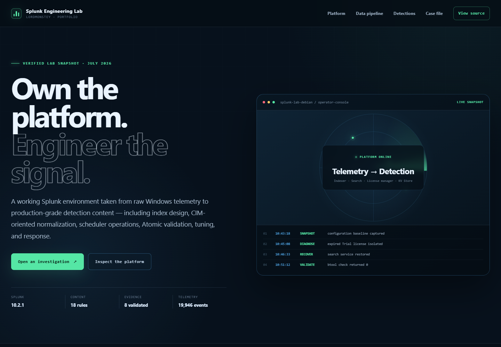
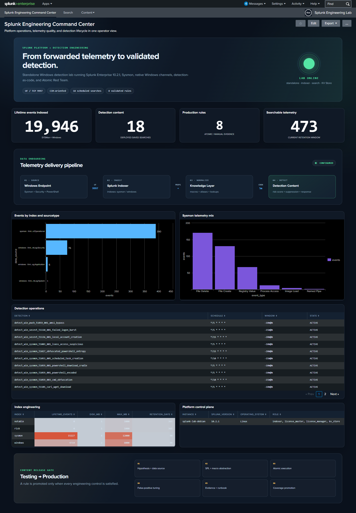

# Splunk Platform & Detection Engineering Lab

[](https://lordmonstey.github.io/splunk-detection-lab/)
[](detections/)
[](coverage/coverage.md)
[](conf/splunk/)

An evidence-backed portfolio project spanning both sides of reliable security
monitoring: **Splunk platform administration** and **detection engineering**.

The public portfolio is a static, sanitized snapshot. It does not depend on a
running lab VM and exposes no Splunk management endpoint.

[Open the interactive case files](https://lordmonstey.github.io/splunk-detection-lab/)

The interface defaults to French and includes a persistent English switch. Its
layout deliberately follows a Splunk operator workflow: SPL search, job status,
index tables, scheduled-search inventory, investigation fields, and committed
evidence.



The public experience is backed by a real implementation inside Splunk:



That native capture and the public interface describe the same sanitized
July 25 checkpoint. Promotion status remains derived from
[`coverage/coverage.md`](coverage/coverage.md), the versioned source of truth.

## What this proves

| Capability | Implemented evidence |
|---|---|
| Platform administration | Dedicated indexes, retention, inputs, parsing, routing, license recovery, effective-config validation |
| Platform hardening | Rotated credentials, key-only SSH, loopback-only management API, default-deny host firewall |
| Windows onboarding | Sysmon plus Security, System, and Application channels through a Universal Forwarder |
| Detection-as-code | 18 versioned saved searches with hypotheses, SPL, tuning, severity, risk, response, and promotion status |
| Validation | 7 Production rules backed by reproduction evidence; one Certutil test retained as a documented validation finding |
| Content operations | 5–15 minute schedules, macro abstraction, lookups, release gates, ATT&CK coverage |
| Analyst usability | Custom native Splunk command center, public investigation workbench, and response runbooks |

## Verified lab snapshot

| Platform signal | Value |
|---|---:|
| Splunk Enterprise | 10.2.1 |
| Lifetime events indexed | 19,946 |
| Current searchable window | 473 |
| Saved searches deployed | 18 |
| Production / validated rules | 7 |
| Testing candidates | 11 |
| Endpoint retention | 90 days |
| Configured risk / notable retention | 365 days |

These values were captured from the running control plane and exported as a
fixed portfolio snapshot. The site never calls the VM or the Splunk REST API.
The sanitized values, exact aggregate queries, evidence hashes, and redaction
scope are versioned in
[`artifacts/public/splunk-snapshot-20260725.json`](artifacts/public/splunk-snapshot-20260725.json).
The corresponding live deployment checks are recorded separately in
[`artifacts/public/splunk-config-validation-20260725.json`](artifacts/public/splunk-config-validation-20260725.json).

## Architecture

```text
Windows endpoint               Debian Splunk server               Detection layer
----------------               --------------------               ---------------
Sysmon                 ─┐
Security               ─┼─ Universal Forwarder ─TCP/9997─> indexes: sysmon/windows
System                 ─┤                                   │
Application            ─┘                                   ├─ macros / field normalization
                                                            ├─ props / transforms / lookups
                                                            └─ 18 scheduled detections
```

See [the full architecture](docs/architecture.md), [deployment decisions](docs/adr/),
and [production gaps](docs/production-gap.md).

## Validated detections

| ATT&CK | Detection | Test method | Evidence |
|---|---|---|---|
| T1003.001 | [Suspicious LSASS process access](detections/win_sysmon_t1003.001_lsass_access_suspicious.md) | Atomic Red Team | [Splunk result](tests/atomic/evidence/T1003.001-detection-fired.png) |
| T1059.001 | [PowerShell encoded command](detections/win_sysmon_t1059.001_powershell_encoded.md) | Controlled manual test | [Splunk result](tests/atomic/evidence/T1059.001-encoded-powershell.png) |
| T1136.001 | [Local account creation](detections/win_secevt_t1136.001_local_account_creation.md) | Atomic Red Team | [Splunk result](tests/atomic/evidence/T1136.001-local-account.png) |
| T1218.005 | [Mshta execution](detections/win_sysmon_t1218.005_mshta_execution.md) | Atomic Red Team | [Splunk result](tests/atomic/evidence/T1218.005-mshta-vbscript.png) |
| T1218.010 | [Regsvr32 scriptlet execution](detections/win_sysmon_t1218.010_regsvr32_remote.md) | Atomic Red Team | [Splunk result](tests/atomic/evidence/T1218.010-regsvr32-squiblydoo.png) |
| T1218.011 | [Rundll32 with unusual parent](detections/win_sysmon_t1218.011_rundll32_unusual_parent.md) | Controlled manual test | [Splunk result](tests/atomic/evidence/T1218.011-rundll32.png) |
| T1547.001 | [Run key modification](detections/win_sysmon_t1547.001_run_key_modification.md) | Controlled manual test | [Splunk result](tests/atomic/evidence/T1547.001-run-key.png) |

Certutil remains `Testing`: its committed
[T1140 finding](tests/atomic/evidence/T1140-certutil-decode.png) demonstrated
that a renamed binary bypassed the original image-path filter. The candidate
now checks `OriginalFileName`, but it will not return to Production until that
path is revalidated end to end.

The complete catalog and promotion rules are in
[coverage/coverage.md](coverage/coverage.md). The matching ATT&CK Navigator layer
is [coverage/navigator-layer.json](coverage/navigator-layer.json).

## Native Splunk implementation

The repository contains a deployable Splunk app rather than screenshots alone:

- Custom dashboard:
  [splunk_engineering_command_center.xml](conf/splunk/local/data/ui/views/splunk_engineering_command_center.xml)
- Navigation:
  [default.xml](conf/splunk/local/data/ui/nav/default.xml)
- Presentation layer:
  [splunk_engineering.css](conf/splunk/appserver/static/splunk_engineering.css)
- 18 scheduled rules:
  [savedsearches.conf](conf/splunk/local/savedsearches.conf)
- Index and retention policy:
  [indexes.conf](conf/splunk/local/indexes.conf)

## Detection contract

Every detection is reviewed as an operational unit:

1. Adversary-behavior hypothesis
2. Required event source and fields
3. SPL written against reusable macros
4. Known false positives and tuning controls
5. Exact validation procedure
6. Severity, risk score, and execution schedule
7. Analyst response path
8. Evidence required for promotion from `Testing` to `Production`

The authoring contract is defined in [CONVENTIONS.md](CONVENTIONS.md), and the
rule template lives at [detections/_template.md](detections/_template.md).

## Repository map

```text
conf/                  Splunk app, indexes, parsing, routing, saved searches
detections/            Detection specifications and SPL
lookups/               Explicit tuning and enrichment controls
coverage/              Release inventory and ATT&CK Navigator layer
tests/atomic/           Reproduction mappings and committed proof
docs/runbooks/          Analyst triage and response
scripts/               Configuration and content validators
site/                  VM-independent static GitHub Pages portfolio
screenshots/           Native Splunk implementation proof
```

## Validate locally

```bash
python scripts/validate_conf.py
python scripts/validate_detections.py
python -m json.tool coverage/navigator-layer.json
```

To preview the public portfolio:

```bash
python -m http.server 8080 --directory site
```

Then open `http://localhost:8080`.

## Scope and honest constraints

This is a standalone engineering lab, not a claim that Splunk Enterprise
Security is installed in the public environment.

- Sysmon and native Windows event channels are the primary telemetry.
- Seven detections are Production with committed reproduction evidence.
  Eleven remain explicitly labeled `Testing`; the Certutil evidence records a
  failed promotion gate rather than a successful validation.
- Risk and notable indexes model an ES-ready content path, but no ES-only
  feature is presented as active.
- There is no SOAR, clustered index tier, deployment server, or domain
  controller in this lab.
- Splunk Free restored local search after the Enterprise Trial expired; remote
  management login remains disabled.

The production hardening plan is documented in [docs/production-gap.md](docs/production-gap.md).

## License

MIT. Use it, fork it, test it, and challenge the detections.
