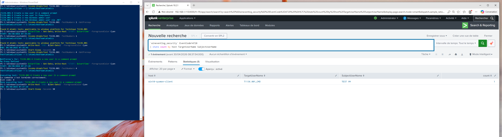

## Hypothesis

Local account creation on a domain-joined workstation is rare and almost always abnormal. Adversaries create local accounts to establish persistence that survives password resets and centralized account disablement. EID 4720 captures every creation; EID 4732 (added to local group) and EID 4724 (password reset) are common follow-ups worth correlating.

## Logic

```spl
`wineventlog_security` EventID=4720
| `cim_endpoint_processes_rename`
| stats count min(_time) as firstTime max(_time) as lastTime
        values(TargetUserName) as new_account
        values(TargetDomainName) as new_account_domain
        values(SubjectUserName) as creator
        by dest
| `security_content_ctime(firstTime)`
| `security_content_ctime(lastTime)`
```

## Known false positives

- IT-driven account creation following standard tickets — verify against change records
- Some Windows update routines create temporary local accounts that are short-lived; usually identifiable by name pattern (e.g., `defaultuser0`)

## Tuning

- Allowlist by name pattern in `lookups/allowlist_local_accounts.csv`
- Always correlate with subsequent EID 4732 (group addition, especially Administrators) — that combo is a high-confidence finding

## Validation

- Atomic Red Team: T1136.001 #1 — `net user atomic-test /add`

Manual reproduction (administrator required):

```cmd
net user atomic-test "AT0mic-T3st-Pwd!" /add
net localgroup Administrators atomic-test /add
```

Cleanup:

```cmd
net localgroup Administrators atomic-test /delete
net user atomic-test /delete
```


**Validated**: 2026-04-30 via Atomic Red Team T1136.001-4 (Create a new user in a command prompt) on lab host `win10-sysmon-client`.

Detection pivots on Windows Security EID 4720 (account created). Lab requires `auditpol /set /category:'Account Management' /success:enable` for this to work - this is a real production gotcha worth documenting.

**Evidence**: 

**Test command**: `Invoke-AtomicTest T1136.001 -TestNumbers 4`

**Cleanup**: `Invoke-AtomicTest T1136.001 -TestNumbers 4 -Cleanup`

## Response

See [`docs/runbooks/persistence-investigation.md`](../docs/runbooks/persistence-investigation.md).

1. Verify whether the account creation matches a change ticket
2. Check whether the new account was added to a privileged group (4732 with Administrators target)
3. If unauthorized: disable the account, capture creation context (Subject*), pivot on `creator` user for compromise scope
