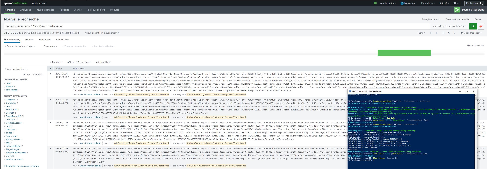

## Hypothesis

Mimikatz, ProcDump, taskmgr-with-dump, and equivalent tools all open a handle to `lsass.exe` with read-memory rights to extract credential material. Legitimate accessors of LSASS (Defender, MsMpEng, csrss, wininit) are a small, stable set; everything else is suspicious. Specific access masks (`0x1010`, `0x1410`, `0x1438`) signal memory read intent.

## Logic

```spl
`sysmon_process_access` EventID=10
TargetImage="*\\lsass.exe"
| eval source_name = mvindex(split(SourceImage,"\\"), -1)
| where NOT match(source_name, "(?i)^(MsMpEng|MsSense|csrss|wininit|svchost|lsass|services|TaskMgr|VsTskMgr|SgrmBroker)\.exe$")
   AND (GrantedAccess="0x1010" OR GrantedAccess="0x1410" OR GrantedAccess="0x1438" OR GrantedAccess="0x143a" OR GrantedAccess="0x1fffff")
| `cim_endpoint_processes_rename`
| stats count min(_time) as firstTime max(_time) as lastTime
        values(SourceImage) as source_images
        values(SourceCommandLine) as source_cmds
        values(GrantedAccess) as access_masks
        values(CallTrace) as call_traces
        by dest user SourceProcessGUID
| `security_content_ctime(firstTime)`
| `security_content_ctime(lastTime)`
```

## Known false positives

- Endpoint security agents not in the baseline above — add them to `lookups/allowlist_lsass_access.csv` after verifying the publisher signature
- Process Hacker / System Informer when used by IT — uncommon outside admin sessions, allowlist by SourceImage
- Some performance monitoring agents (Datadog, Dynatrace) request limited access — accept after vendor verification

## Tuning

- The access mask filter is the precision lever — broad masks like `0x1fffff` are post-exploit signals; narrow masks like `0x1000` are mostly benign monitoring
- Allowlist by `(source_name, signer)` not just process name to thwart rename-based evasion
- No suppression — every alert here is actionable

## Validation

- Atomic Red Team: T1003.001 #1 — Mimikatz `sekurlsa::logonpasswords`
- Atomic Red Team: T1003.001 #2 — ProcDump on LSASS

Manual reproduction with ProcDump (signed Microsoft tool, easy to validate):

```cmd
procdump.exe -accepteula -ma lsass.exe lsass.dmp
```

Cleanup:

```cmd
del lsass.dmp
```


**Validated**: 2026-04-29 via Atomic Red Team T1003.001-1 (ProcDump) on lab host `win10-sysmon-client`.

The procdump.exe and procdump64.exe processes both opened LSASS with GrantedAccess 0x1fffff (PROCESS_ALL_ACCESS), which is the smoking gun. Sysmon-modular tagged the event with RuleName=technique_id=T1003,technique_name=Credential Dumping out of the box, which is a nice bonus.

**Tuning note**: the original regex match against GrantedAccess used `^...---
id: win_sysmon_t1003.001_lsass_access_suspicious
title: Suspicious access to LSASS process memory
status: production
author: LordMonstey
created: 2026-04-28
modified: 2026-04-28
severity: critical
risk_score: 90
attack:
  - tactic: credential-access
    technique: T1003.001
    sub_technique_name: LSASS Memory
data_source:
  index: sysmon
  sourcetype: XmlWinEventLog:Microsoft-Windows-Sysmon/Operational
  event_codes: [10]
mitre_data_component: Process Access
schedule:
  cron: "*/5 * * * *"
  earliest: "-10m@m"
  latest:   "-1m@m"
references:
  - https://attack.mitre.org/techniques/T1003/001/
  - https://github.com/gentilkiwi/mimikatz
tags:
  - credential-access
  - lsass
  - critical
---

## Hypothesis

Mimikatz, ProcDump, taskmgr-with-dump, and equivalent tools all open a handle to `lsass.exe` with read-memory rights to extract credential material. Legitimate accessors of LSASS (Defender, MsMpEng, csrss, wininit) are a small, stable set; everything else is suspicious. Specific access masks (`0x1010`, `0x1410`, `0x1438`) signal memory read intent.

## Logic

```spl
`sysmon_process_access` EventID=10
TargetImage="*\\lsass.exe"
| eval source_name = mvindex(split(SourceImage,"\\"), -1)
| where NOT match(source_name, "(?i)^(MsMpEng|MsSense|csrss|wininit|svchost|lsass|services|TaskMgr|VsTskMgr|SgrmBroker)\.exe$")
   AND (GrantedAccess="0x1010" OR GrantedAccess="0x1410" OR GrantedAccess="0x1438" OR GrantedAccess="0x143a" OR GrantedAccess="0x1fffff")
| `cim_endpoint_processes_rename`
| stats count min(_time) as firstTime max(_time) as lastTime
        values(SourceImage) as source_images
        values(SourceCommandLine) as source_cmds
        values(GrantedAccess) as access_masks
        values(CallTrace) as call_traces
        by dest user SourceProcessGUID
| `security_content_ctime(firstTime)`
| `security_content_ctime(lastTime)`
```

## Known false positives

- Endpoint security agents not in the baseline above — add them to `lookups/allowlist_lsass_access.csv` after verifying the publisher signature
- Process Hacker / System Informer when used by IT — uncommon outside admin sessions, allowlist by SourceImage
- Some performance monitoring agents (Datadog, Dynatrace) request limited access — accept after vendor verification

## Tuning

- The access mask filter is the precision lever — broad masks like `0x1fffff` are post-exploit signals; narrow masks like `0x1000` are mostly benign monitoring
- Allowlist by `(source_name, signer)` not just process name to thwart rename-based evasion
- No suppression — every alert here is actionable

## Validation

- Atomic Red Team: T1003.001 #1 — Mimikatz `sekurlsa::logonpasswords`
- Atomic Red Team: T1003.001 #2 — ProcDump on LSASS

Manual reproduction with ProcDump (signed Microsoft tool, easy to validate):

```cmd
procdump.exe -accepteula -ma lsass.exe lsass.dmp
```

Cleanup:

```cmd
del lsass.dmp
```

 anchors which did not match cleanly in this Splunk version. Replaced with explicit `OR` filters on the access mask values, which is faster (filtered at index time) and more readable.

**Evidence**:

-  — ProcDump executing + Sysmon raw events
-  — detection SPL output

**Test command**: `Invoke-AtomicTest T1003.001 -TestNumbers 1`

**Cleanup**: `Invoke-AtomicTest T1003.001 -TestNumbers 1 -Cleanup` plus manual removal of `C:\Windows\Temp\lsass_dump.dmp`.


**Validated**: 2026-04-29 via Atomic Red Team T1003.001-1 (ProcDump) on lab host `win10-sysmon-client`.

The procdump.exe and procdump64.exe processes both opened LSASS with GrantedAccess 0x1fffff (PROCESS_ALL_ACCESS), which is the smoking gun. Sysmon-modular tagged the event with RuleName=technique_id=T1003,technique_name=Credential Dumping out of the box, which is a nice bonus.

**Tuning note**: the original regex match against GrantedAccess used `^...---
id: win_sysmon_t1003.001_lsass_access_suspicious
title: Suspicious access to LSASS process memory
status: production
author: LordMonstey
created: 2026-04-28
modified: 2026-04-28
severity: critical
risk_score: 90
attack:
  - tactic: credential-access
    technique: T1003.001
    sub_technique_name: LSASS Memory
data_source:
  index: sysmon
  sourcetype: XmlWinEventLog:Microsoft-Windows-Sysmon/Operational
  event_codes: [10]
mitre_data_component: Process Access
schedule:
  cron: "*/5 * * * *"
  earliest: "-10m@m"
  latest:   "-1m@m"
references:
  - https://attack.mitre.org/techniques/T1003/001/
  - https://github.com/gentilkiwi/mimikatz
tags:
  - credential-access
  - lsass
  - critical
---

## Hypothesis

Mimikatz, ProcDump, taskmgr-with-dump, and equivalent tools all open a handle to `lsass.exe` with read-memory rights to extract credential material. Legitimate accessors of LSASS (Defender, MsMpEng, csrss, wininit) are a small, stable set; everything else is suspicious. Specific access masks (`0x1010`, `0x1410`, `0x1438`) signal memory read intent.

## Logic

```spl
`sysmon_process_access` EventID=10
TargetImage="*\\lsass.exe"
| eval source_name = mvindex(split(SourceImage,"\\"), -1)
| where NOT match(source_name, "(?i)^(MsMpEng|MsSense|csrss|wininit|svchost|lsass|services|TaskMgr|VsTskMgr|SgrmBroker)\.exe$")
   AND (GrantedAccess="0x1010" OR GrantedAccess="0x1410" OR GrantedAccess="0x1438" OR GrantedAccess="0x143a" OR GrantedAccess="0x1fffff")
| `cim_endpoint_processes_rename`
| stats count min(_time) as firstTime max(_time) as lastTime
        values(SourceImage) as source_images
        values(SourceCommandLine) as source_cmds
        values(GrantedAccess) as access_masks
        values(CallTrace) as call_traces
        by dest user SourceProcessGUID
| `security_content_ctime(firstTime)`
| `security_content_ctime(lastTime)`
```

## Known false positives

- Endpoint security agents not in the baseline above — add them to `lookups/allowlist_lsass_access.csv` after verifying the publisher signature
- Process Hacker / System Informer when used by IT — uncommon outside admin sessions, allowlist by SourceImage
- Some performance monitoring agents (Datadog, Dynatrace) request limited access — accept after vendor verification

## Tuning

- The access mask filter is the precision lever — broad masks like `0x1fffff` are post-exploit signals; narrow masks like `0x1000` are mostly benign monitoring
- Allowlist by `(source_name, signer)` not just process name to thwart rename-based evasion
- No suppression — every alert here is actionable

## Validation

- Atomic Red Team: T1003.001 #1 — Mimikatz `sekurlsa::logonpasswords`
- Atomic Red Team: T1003.001 #2 — ProcDump on LSASS

Manual reproduction with ProcDump (signed Microsoft tool, easy to validate):

```cmd
procdump.exe -accepteula -ma lsass.exe lsass.dmp
```

Cleanup:

```cmd
del lsass.dmp
```


**Validated**: 2026-04-29 via Atomic Red Team T1003.001-1 (ProcDump) on lab host `win10-sysmon-client`.

The procdump.exe and procdump64.exe processes both opened LSASS with GrantedAccess 0x1fffff (PROCESS_ALL_ACCESS), which is the smoking gun. Sysmon-modular tagged the event with RuleName=technique_id=T1003,technique_name=Credential Dumping out of the box, which is a nice bonus.

**Tuning note**: the original regex match against GrantedAccess used `^...---
id: win_sysmon_t1003.001_lsass_access_suspicious
title: Suspicious access to LSASS process memory
status: production
author: LordMonstey
created: 2026-04-28
modified: 2026-04-28
severity: critical
risk_score: 90
attack:
  - tactic: credential-access
    technique: T1003.001
    sub_technique_name: LSASS Memory
data_source:
  index: sysmon
  sourcetype: XmlWinEventLog:Microsoft-Windows-Sysmon/Operational
  event_codes: [10]
mitre_data_component: Process Access
schedule:
  cron: "*/5 * * * *"
  earliest: "-10m@m"
  latest:   "-1m@m"
references:
  - https://attack.mitre.org/techniques/T1003/001/
  - https://github.com/gentilkiwi/mimikatz
tags:
  - credential-access
  - lsass
  - critical
---

## Hypothesis

Mimikatz, ProcDump, taskmgr-with-dump, and equivalent tools all open a handle to `lsass.exe` with read-memory rights to extract credential material. Legitimate accessors of LSASS (Defender, MsMpEng, csrss, wininit) are a small, stable set; everything else is suspicious. Specific access masks (`0x1010`, `0x1410`, `0x1438`) signal memory read intent.

## Logic

```spl
`sysmon_process_access` EventID=10
TargetImage="*\\lsass.exe"
| eval source_name = mvindex(split(SourceImage,"\\"), -1)
| where NOT match(source_name, "(?i)^(MsMpEng|MsSense|csrss|wininit|svchost|lsass|services|TaskMgr|VsTskMgr|SgrmBroker)\.exe$")
   AND (GrantedAccess="0x1010" OR GrantedAccess="0x1410" OR GrantedAccess="0x1438" OR GrantedAccess="0x143a" OR GrantedAccess="0x1fffff")
| `cim_endpoint_processes_rename`
| stats count min(_time) as firstTime max(_time) as lastTime
        values(SourceImage) as source_images
        values(SourceCommandLine) as source_cmds
        values(GrantedAccess) as access_masks
        values(CallTrace) as call_traces
        by dest user SourceProcessGUID
| `security_content_ctime(firstTime)`
| `security_content_ctime(lastTime)`
```

## Known false positives

- Endpoint security agents not in the baseline above — add them to `lookups/allowlist_lsass_access.csv` after verifying the publisher signature
- Process Hacker / System Informer when used by IT — uncommon outside admin sessions, allowlist by SourceImage
- Some performance monitoring agents (Datadog, Dynatrace) request limited access — accept after vendor verification

## Tuning

- The access mask filter is the precision lever — broad masks like `0x1fffff` are post-exploit signals; narrow masks like `0x1000` are mostly benign monitoring
- Allowlist by `(source_name, signer)` not just process name to thwart rename-based evasion
- No suppression — every alert here is actionable

## Validation

- Atomic Red Team: T1003.001 #1 — Mimikatz `sekurlsa::logonpasswords`
- Atomic Red Team: T1003.001 #2 — ProcDump on LSASS

Manual reproduction with ProcDump (signed Microsoft tool, easy to validate):

```cmd
procdump.exe -accepteula -ma lsass.exe lsass.dmp
```

Cleanup:

```cmd
del lsass.dmp
```

 anchors which did not match cleanly in this Splunk version. Replaced with explicit `OR` filters on the access mask values, which is faster (filtered at index time) and more readable.

**Evidence**:

-  — ProcDump executing + Sysmon raw events
-  — detection SPL output

**Test command**: `Invoke-AtomicTest T1003.001 -TestNumbers 1`

**Cleanup**: `Invoke-AtomicTest T1003.001 -TestNumbers 1 -Cleanup` plus manual removal of `C:\Windows\Temp\lsass_dump.dmp`.

 anchors which did not match cleanly in this Splunk version. Replaced with explicit `OR` filters on the access mask values, which is faster (filtered at index time) and more readable.

**Evidence**:

-  — ProcDump executing + Sysmon raw events
-  — detection SPL output

**Test command**: `Invoke-AtomicTest T1003.001 -TestNumbers 1`

**Cleanup**: `Invoke-AtomicTest T1003.001 -TestNumbers 1 -Cleanup` plus manual removal of `C:\Windows\Temp\lsass_dump.dmp`.

## Response

See [`docs/runbooks/credential-access.md`](../docs/runbooks/credential-access.md).

This is a **critical** alert. Immediate actions:

1. Isolate the host from the network (EDR or firewall ACL)
2. Force-rotate any privileged credential observed logged onto the host in the last 24 hours
3. Capture the source process's image hash, command line, and parent — preserve for IR
4. Pivot on `SourceProcessGUID` for the full execution chain
5. Search every other host for the same process hash — credential dumping is rarely a single-host event
