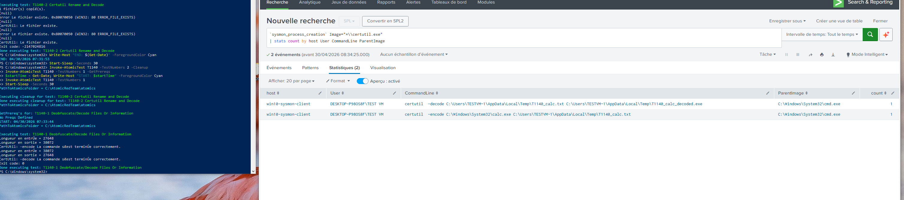

## Hypothesis

`certutil.exe` legitimately manages certificates but supports `-decode`/`-decodehex` flags that turn it into a Base64 deobfuscator and `-urlcache -split -f <URL>` that turns it into a downloader. Adversaries use both. Legitimate cert management never uses `-decode` against arbitrary files.

## Logic

```spl
`sysmon_process_creation`
process_name="certutil.exe"
| where match(CommandLine, "(?i)\s-(decode|decodehex|encode|encodehex|urlcache)\b")
   OR match(CommandLine, "(?i)\s-split\s+-f\s+https?://")
| `cim_endpoint_processes_rename`
| stats count min(_time) as firstTime max(_time) as lastTime
        values(CommandLine) as commandlines
        values(parent_process_name) as parents
        by dest user process_name process_guid
| `security_content_ctime(firstTime)`
| `security_content_ctime(lastTime)`
```

## Known false positives

- Certificate management on a CA or PKI server — but on a workstation, near-zero
- Some niche IT scripts encode/decode internal certs as part of provisioning — allowlist by parent

## Tuning

- Allowlist by `(parent_process_name, command_pattern)`
- Suppression: 1 hour per `(dest, process_guid)`

## Validation

- Atomic Red Team: T1140 #4 — Certutil decode

Manual reproduction:

```cmd
echo "YXRvbWljLXRlc3Q=" > b64.txt
certutil.exe -decode b64.txt out.txt
type out.txt
```

Cleanup:

```cmd
del b64.txt out.txt
```


**Validated**: 2026-04-30 via Atomic Red Team T1140-2 (Certutil Rename and Decode) on lab host `win10-sysmon-client`.

T1140-2 renames certutil before use, which defeats simple `Image=*\\certutil.exe` filters. The detection should pivot on Sysmon `OriginalFileName=CertUtil.exe` (extracted from the PE header) instead. This is a real defense-evasion lesson worth noting in the rule.

**Evidence**: 

**Test command**: `Invoke-AtomicTest T1140 -TestNumbers 2`

**Cleanup**: `Invoke-AtomicTest T1140 -TestNumbers 2 -Cleanup`

## Response

See [`docs/runbooks/lolbin-proxy-execution.md`](../docs/runbooks/lolbin-proxy-execution.md).

1. The decoded output filename is in CommandLine — pull `\`sysmon_file_create\` host=<dest> file_path=<output>` to see what was produced
2. Hash the output file, check VirusTotal
3. Escalate if the decoded file is then executed (FileCreate → ProcessCreate chain)
