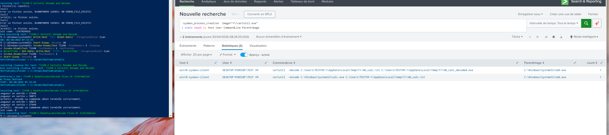

## Hypothesis

`certutil.exe` legitimately manages certificates but supports `-decode`/`-decodehex` flags that turn it into a Base64 deobfuscator and `-urlcache -split -f <URL>` that turns it into a downloader. Adversaries use both. Legitimate cert management never uses `-decode` against arbitrary files.

## Logic

```spl
`sysmon_process_creation` (Image="*\\certutil.exe" OR OriginalFileName="CertUtil.exe") | where match(CommandLine, "(?i)\\s-(decode|decodehex|encode|encodehex|urlcache)\\b") OR match(CommandLine, "(?i)\\s-split\\s+-f\\s+https?://") | `cim_endpoint_processes_rename` | stats count min(_time) as firstTime max(_time) as lastTime values(CommandLine) as commandlines values(parent_process_name) as parents by dest user process_name process_guid
```

## Known false positives

- Certificate management on a CA or PKI server — but on a workstation, near-zero
- Some niche IT scripts encode/decode internal certs as part of provisioning — allowlist by parent

## Tuning

- Allowlist by `(parent_process_name, command_pattern)`
- Suppression: 1 hour per `(dest, process_guid)`

## Validation

- Atomic Red Team: T1140 #2 — Certutil Rename and Decode

Manual reproduction:

```cmd
echo "YXRvbWljLXRlc3Q=" > b64.txt
certutil.exe -decode b64.txt out.txt
type out.txt
```

Cleanup:

```cmd
del b64.txt out.txt
```


**Validation finding**: on 2026-04-30, Atomic Red Team T1140 #2 renamed
`certutil.exe` before use. That bypassed the original `Image=*\\certutil.exe`
filter and demonstrated that the previous Production claim was not justified.

The candidate now also checks Sysmon `OriginalFileName=CertUtil.exe`, but the
existing capture does not prove that the raw field was extracted and matched
end to end. The rule therefore remains **Testing** until the test is rerun and a
new Splunk result is committed.

**Finding evidence**: 

**Test command**: `Invoke-AtomicTest T1140 -TestNumbers 2`

**Cleanup**: `Invoke-AtomicTest T1140 -TestNumbers 2 -Cleanup`

## Response

See [`docs/runbooks/lolbin-proxy-execution.md`](../docs/runbooks/lolbin-proxy-execution.md).

1. The decoded output filename is in CommandLine — pivot with
   `` `sysmon_file_create` host=<dest> file_path=<output> `` to see what was
   produced.
2. Hash the output file, check VirusTotal
3. Escalate if the decoded file is then executed (FileCreate → ProcessCreate chain)
