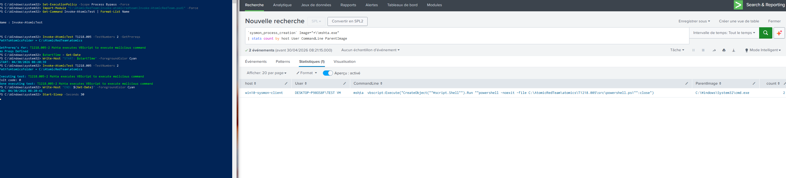

## Hypothesis

`mshta.exe` executes Microsoft HTML Application (HTA) files and can also evaluate inline VBScript/JavaScript. Adversaries use it to run remote payloads (`mshta.exe http://...`) or inline scripts that bypass application allowlisting. Modern Windows installs have essentially no legitimate use of mshta.

## Logic

```spl
`sysmon_process_creation`
process_name="mshta.exe"
| where match(CommandLine, "(?i)https?://|javascript:|vbscript:|about:|\.hta\b")
| `cim_endpoint_processes_rename`
| stats count min(_time) as firstTime max(_time) as lastTime
        values(CommandLine) as commandlines
        values(parent_process_name) as parents
        by dest user process_name process_guid
| `security_content_ctime(firstTime)`
| `security_content_ctime(lastTime)`
```

## Known false positives

- Some legacy enterprise applications still ship HTA management consoles → allowlist by file path of the .hta in `lookups/allowlist_mshta.csv`
- Vendor uninstallers occasionally use HTA UIs

## Tuning

- Allowlist by `.hta` file path
- Suppression: 1 hour per `(dest, process_guid)`

## Validation

- Atomic Red Team: T1218.005 #1 — `mshta.exe` executes JavaScript scheme

Manual reproduction:

```cmd
mshta.exe vbscript:Close(Execute("CreateObject(""Wscript.Shell"").Run ""calc.exe"""))
```


**Validated**: 2026-04-30 via Atomic Red Team T1218.005-2 (Mshta executes VBScript to execute malicious command) on lab host `win10-sysmon-client`.

The CommandLine `mshta vbscript:Execute("CreateObject(...).Run(...)")` is the smoking gun. Atomic launches it via cmd.exe spawning powershell, but in real attacks mshta is usually launched by Office macros or HTA download cradles.

**Evidence**: 

**Test command**: `Invoke-AtomicTest T1218.005 -TestNumbers 2`

**Cleanup**: `Invoke-AtomicTest T1218.005 -TestNumbers 2 -Cleanup`

## Response

See [`docs/runbooks/lolbin-proxy-execution.md`](../docs/runbooks/lolbin-proxy-execution.md).
