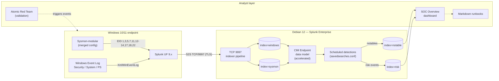

# Architecture

## Component diagram

## Data flow

1. **Generate** — Windows produces native event logs and Sysmon emits enriched telemetry
2. **Forward** — UF tails the event channels with `renderXml=true` and forwards to the indexer over TCP/9997
3. **Index** — Splunk routes events into `windows` or `sysmon` based on input stanzas
4. **Normalize** — `props.conf` / `transforms.conf` ensure consistent sourcetypes; macros provide CIM-friendly access
5. **Detect** — scheduled saved searches run against macros and the Endpoint data model; results are written to `index=notable` (alerts) and `index=risk` (RBA accumulation)
6. **Triage** — analyst opens the SOC Overview dashboard, follows the matching runbook
7. **Validate** — Atomic Red Team tests are run on the endpoint; the resulting events confirm or break the detection

## Index design rationale

| Index | Purpose | Retention |
|---|---|---|
| `windows` | Native Windows channels | 90 days |
| `sysmon` | Sysmon EIDs (separated for retention/sizing tuning) | 90 days |
| `risk` | Per-event risk modifiers for RBA aggregation | 365 days |
| `notable` | Alert summary (one event per fired detection) | 365 days |

Separating `sysmon` from `windows` is intentional: Sysmon volume is materially higher and benefits from independent sizing, retention, and (eventually) SmartStore policy.

## Out of scope (deliberate)

- Active Directory and DC events — single-host lab, no domain
- Network telemetry (Zeek, firewall) — would require a third VM
- EDR — relying on Sysmon only is part of the exercise
- Splunk ES — RBA implemented in raw SPL (`risk` index) instead
