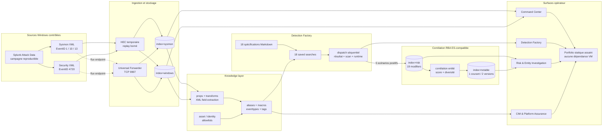
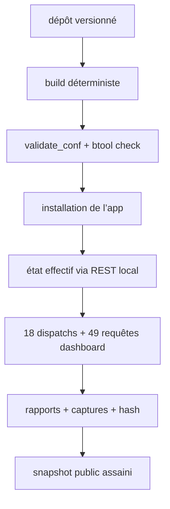

# Architecture technique

## Vue fonctionnelle

```mermaid
flowchart LR
    subgraph SRC["Sources Windows contrôlées"]
      SYS["Sysmon XML<br/>EventID 1 / 10 / 13"]
      SEC["Security XML<br/>EventID 4720"]
      DATA["Splunk Attack Data<br/>campagne reproductible"]
      DATA --> SYS
      DATA --> SEC
    end

    subgraph INGEST["Ingestion et stockage"]
      HEC["HEC temporaire<br/>replay borné"]
      UF["Universal Forwarder<br/>TCP 9997"]
      WIDX[("index=windows")]
      SIDX[("index=sysmon")]
      SYS --> HEC
      SEC --> HEC
      SYS -. "flux endpoint" .-> UF
      SEC -. "flux endpoint" .-> UF
      HEC --> SIDX
      HEC --> WIDX
      UF --> SIDX
      UF --> WIDX
    end

    subgraph KNOW["Knowledge layer"]
      PARSE["props + transforms<br/>XML field extraction"]
      CIM["aliases + macros<br/>eventtypes + tags"]
      ENRICH["asset / identity<br/>allowlists"]
      SIDX --> PARSE
      WIDX --> PARSE
      PARSE --> CIM
      ENRICH --> CIM
    end

    subgraph FACTORY["Detection Factory"]
      SPEC["18 spécifications Markdown"]
      SAVED["18 saved searches"]
      DISPATCH["dispatch séquentiel<br/>résultat + scan + runtime"]
      SPEC --> SAVED
      CIM --> SAVED
      SAVED --> DISPATCH
    end

    subgraph RBA["Corrélation RBA ES-compatible"]
      RISK[("index=risk<br/>19 modifiers")]
      CORR["corrélation entité<br/>score + diversité"]
      FIND[("index=notable<br/>1 courant / 2 versions")]
      DISPATCH -->|"5 scénarios positifs"| RISK
      RISK --> CORR
      CORR --> FIND
    end

    subgraph SURFACE["Surfaces opérateur"]
      CC["Command Center"]
      DF["Detection Factory"]
      RI["Risk & Entity Investigation"]
      PA["CIM & Platform Assurance"]
      STATIC["Portfolio statique assaini<br/>aucune dépendance VM"]
      SIDX --> CC
      WIDX --> CC
      DISPATCH --> DF
      RISK --> RI
      FIND --> RI
      CIM --> PA
      CC --> STATIC
      DF --> STATIC
      RI --> STATIC
      PA --> STATIC
    end
```

Deux chemins d’ingestion sont volontairement distingués :

- le chemin endpoint durable repose sur le Universal Forwarder et TCP/9997 ;
- le replay de validation utilise un input HEC temporaire et borné, uniquement
  pour rejouer un dataset contrôlé sans exécuter de payload sur un poste.

Le résultat public ne dépend d’aucun de ces chemins : il est exporté sous forme
d’agrégats et de captures statiques.

## Contrats de données

| Domaine | Index | Sourcetype | Rétention | Contrat |
|---|---|---|---:|---|
| Processus / registre | `sysmon` | `XmlWinEventLog:Microsoft-Windows-Sysmon/Operational` | 90 j | XML extrait, aliases et champs processus normalisés |
| Sécurité Windows | `windows` | `XmlWinEventLog:Security` | 90 j | événement natif, champs compte/hôte conservés |
| Risque | `risk` | `stash` | 365 j | un événement par contribution de détection et entité |
| Finding | `notable` | `stash` | 365 j | état corrélé versionné, file courante dédupliquée |

Les champs processus mesurés dans la campagne sont `process`, `process_guid`,
`process_name`, `user`, `dest`, `process_cmdline` et `parent_process_path`.
Chacun atteint 100 % de complétude sur les 134 événements de création de
processus.

## Séparation des responsabilités

### Configuration

- `default/` porte le comportement livré par l’application ;
- `local/` ne contient que les overrides intentionnels qui doivent gagner la
  précédence ;
- `metadata/` rend les objets partageables ;
- `lookups/` porte tuning et enrichissement comme données versionnées.

La configuration effective est vérifiée avec `btool`, pas uniquement par
inspection du dépôt. Cette distinction a notamment permis de détecter et
corriger un ancien override local de macros.

### Contenu

La spécification humaine et l’objet Splunk déployé restent liés par
`detection_id`. Le build génère un catalogue lookup utilisé par le dashboard et
un manifeste de package SHA-256. Le validateur compare les 18 spécifications,
les 18 stanzas `savedsearches.conf` et les entrées du portfolio.

### Exécution

Le dispatch est séquentiel pour rendre les résultats déterministes sur une
petite instance et éviter de confondre contention de slots et défaut
d’analytique. Chaque exécution capture :

- état du job ;
- résultat logique ;
- événements et lignes scannés ;
- durée ;
- messages d’erreur.

### Corrélation

Le RBA ne supprime pas le signal unitaire. Les modifiers sont immuables ; le
finding est recalculé et écrit avec un identifiant stable plus un numéro de
version. Le dashboard sélectionne la dernière version pour la file courante et
conserve toutes les versions pour l’audit.

## Plan d’administration

```mermaid
flowchart TB
    SRC["dépôt versionné"] --> BUILD["build déterministe"]
    BUILD --> CHECK["validate_conf + btool check"]
    CHECK --> INSTALL["installation de l’app"]
    INSTALL --> REST["état effectif via REST local"]
    REST --> SEARCH["18 dispatchs + 49 requêtes dashboard"]
    SEARCH --> EVIDENCE["rapports + captures + hash"]
    EVIDENCE --> PUBLIC["snapshot public assaini"]
```

Les interfaces d’administration ne sont pas publiées. SSH utilise des clés et
le management plane splunkd est filtré hors loopback. L’accès Web nécessaire à
la démonstration est une propriété de l’environnement, jamais du site GitHub
Pages.

## Limite native Splunk ES

Le schéma RBA est compatible avec le modèle `risk`/`notable`, mais le package
premium Splunk Enterprise Security n’est pas redistribué et n’est pas déclaré
actif. Lorsqu’un paquet officiel et la licence correspondante sont disponibles,
le chemin d’intégration est documenté dans
[enterprise-security-recovery.md](enterprise-security-recovery.md).
