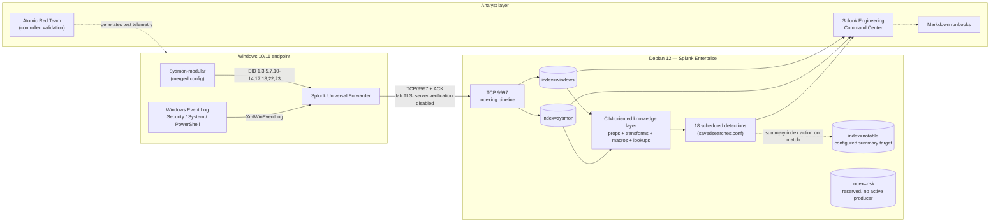

# Architecture

## Component diagram

```mermaid
flowchart LR
    subgraph WIN["Windows 10/11 endpoint"]
      SYSMON["Sysmon-modular<br/>(merged config)"]
      EVTLOG["Windows Event Log<br/>Security / System / PowerShell"]
      UF["Splunk Universal Forwarder"]
      SYSMON -->|EID 1,3,5,7,10-14,17,18,22,23| UF
      EVTLOG -->|XmlWinEventLog| UF
    end

    subgraph SRV["Debian 12 — Splunk Enterprise"]
      direction TB
      RECV["TCP 9997<br/>indexing pipeline"]
      IDX_WIN[("index=windows")]
      IDX_SYS[("index=sysmon")]
      KNOW["CIM-oriented knowledge layer<br/>props + transforms + macros + lookups"]
      SS["18 scheduled detections<br/>(savedsearches.conf)"]
      IDX_NOT[("index=notable<br/>configured summary target")]
      IDX_RISK[("index=risk<br/>reserved, no active producer")]

      RECV --> IDX_WIN
      RECV --> IDX_SYS
      IDX_WIN --> KNOW
      IDX_SYS --> KNOW
      KNOW --> SS
      SS -.->|"summary-index action on match"| IDX_NOT
    end

    UF -- "TCP/9997 + ACK<br/>lab TLS; server verification disabled" --> RECV

    subgraph SOC["Analyst layer"]
      DASH["Splunk Engineering<br/>Command Center"]
      RUN["Markdown runbooks"]
      ATOMIC["Atomic Red Team<br/>(controlled validation)"]
    end

    IDX_WIN --> DASH
    IDX_SYS --> DASH
    SS --> DASH
    DASH -.-> RUN
    ATOMIC -.->|"generates test telemetry"| WIN
```

## Data flow

1. **Generate** — Windows produces native event logs and Sysmon emits enriched
   endpoint telemetry.
2. **Forward** — the Universal Forwarder reads six event-channel inputs with
   `renderXml=true`. `useACK=true` is configured for delivery acknowledgement.
   The lab TLS template currently has `sslVerifyServerCert=false`; certificate
   verification is a documented production-hardening requirement.
3. **Index** — input stanzas route native Windows events to `windows` and Sysmon
   events to `sysmon`.
4. **Normalize** — `props.conf`, `transforms.conf`, macros, and registered
   lookups provide stable sourcetypes and CIM-oriented field names. The
   repository does **not** claim an accelerated CIM Endpoint data model or full
   CIM compliance.
5. **Detect** — 18 saved searches query the indexes through the knowledge
   layer. Matching results are configured to use the `notable` summary index.
   The captured snapshot contains zero `notable` and zero `risk` events, so
   neither active Enterprise Security notables nor Risk-Based Alerting are
   claimed.
6. **Constrain** — `server.conf` limits the splunkd management API to loopback
   because this standalone deployment has no distributed-search or remote REST
   consumer.
7. **Triage** — the analyst uses the native Engineering Command Center and the
   versioned response runbooks.
8. **Validate** — Atomic Red Team or controlled manual tests generate endpoint
   events. Evidence, tuning findings, and promotion status are committed with
   the corresponding detection.

## Index design rationale

| Index | Purpose | Retention | Snapshot state |
|---|---|---:|---|
| `windows` | Native Windows channels | 90 days | Searchable telemetry present |
| `sysmon` | Sysmon endpoint telemetry | 90 days | Searchable telemetry present |
| `notable` | Summary-index target for matching detections | 365 days | Configured, zero events |
| `risk` | Reserved for a future ES/RBA-compatible path | 365 days | Configured, no active producer |

Separating `sysmon` from `windows` is intentional: Sysmon volume is materially
higher and benefits from independent sizing and retention. The two empty
output indexes document an integration boundary; they are not presented as an
active Enterprise Security deployment.

## Out of scope (deliberate)

- Active Directory and domain-controller telemetry — single-endpoint lab.
- Proxy, firewall, Zeek, or NDR telemetry.
- EDR telemetry — endpoint detections rely on Sysmon and native event logs.
- Accelerated CIM data models.
- Splunk Enterprise Security, active RBA, and Incident Review.
- Indexer/search-head clustering, deployment server, and SOAR.
